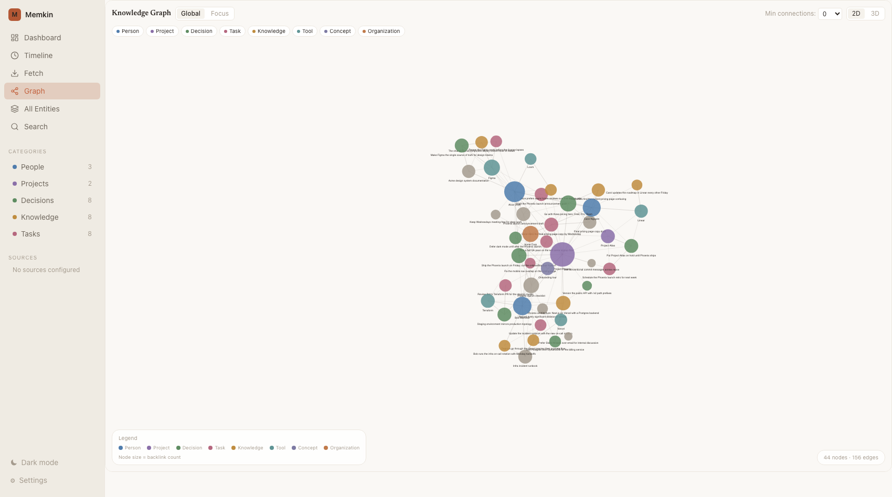

<p align="center">
  
</p>

<h1 align="center">Memkin</h1>

<p align="center">A local-first personal memory system: extracts structured signals from Feishu/Lark and AI coding sessions, builds a knowledge graph on your machine, and serves it to any agent over MCP.</p>

<p align="center">
  <a href="README.md">简体中文</a> | English
</p>

<p align="center">
  <a href="LICENSE"></a>
  <a href="https://www.npmjs.com/package/memkin"></a>
  
  
  <a href="https://glama.ai/mcp/servers/AndreLYL/memkin"></a>
</p>

<p align="center">
  
</p>

AI agent sessions have no memory across sessions: every new session starts by re-explaining who you are, the project background, and past decisions. Memkin extracts the information scattered across Feishu/Lark (DMs, group chats, email, calendar, docs, tasks) and AI coding sessions (Claude Code, Codex, Hermes) into structured signals — entities, decisions, tasks, discoveries, knowledge, relations — stores them in a knowledge graph on your own machine, and exposes them to any agent over MCP for both querying and writing back. All data stays local.

## Features

- **Feishu/Lark capture**: 7 sources — DMs, group chats, email, calendar, docs, tasks, message search — with incremental sync and backfill. See the [Feishu guide](docs/feishu.md) *(Chinese)*
- **AI session capture**: Claude Code (`~/.claude/projects/`), Codex (`~/.codex/`), Hermes/OpenClaw (`~/.openclaw/agents/`)
- **MCP server**: 36 tools (15 high-intent tools exposed by default), stdio and Streamable HTTP transports. See the [MCP guide](docs/mcp.md) *(Chinese)*
- **Signal extraction**: LLM pipeline distills 7 signal types with two-layer noise filtering (rules + LLM scoring); every signal traces back to its source message
- **Hybrid search**: tsvector full-text (CJK-friendly) + pgvector embeddings, fused with RRF
- **Knowledge graph**: signals anchored to entities (people, projects, tools), directed links, cross-platform person identity resolution
- **Privacy**: pre-write redaction (reversible / irreversible), zero cloud dependency (embedded PGLite), optional local embeddings via Ollama
- **Background service**: `memkin up` registers a boot-time daemon with scheduled capture, run history, and alerts
- **Memory consolidation**: hot → warm → cold tier rotation, dead-link repair, preference inference
- **Obsidian two-way sync**: export as a Markdown vault, edit, import back
- **Web UI**: dashboard, timeline, force-directed knowledge graph, search

Full inventory: [Features](docs/features.md) *(Chinese)*.

## Quick Start

One-command install (recommended; registers a background service):

```bash
curl -fsSL https://raw.githubusercontent.com/AndreLYL/memkin/main/scripts/install.sh | sh
```

The script installs the Node runtime if missing → `npm install -g memkin` → opens the browser setup wizard (paste an LLM API key) → runs `memkin up` to register a boot-time background service, and writes MCP config into AI clients found on your machine (Claude Code, Codex, Hermes/OpenClaw).

Try it without a background service:

```bash
npx memkin start     # runs the setup wizard if unconfigured, then serves + opens the Web UI
```

Service management and uninstall:

```bash
memkin status        # background service status
memkin down          # stop the service and disable autostart
memkin down && memkin uninstall && npm rm -g memkin    # remove everything
```

Prerequisite: [Node.js](https://nodejs.org) >= 18 (handled by the install script).

## Connecting AI Agents

`memkin install` writes MCP config and memory-usage instructions into local AI clients. Supported: Claude Code, Claude Desktop, Cursor, Codex, Windsurf, Hermes/OpenClaw:

```bash
memkin install                      # detect installed clients and wire them up
memkin install --agent claude-code  # a single client
memkin install --dry-run            # preview file changes
memkin extract --source claude-code # extract session history into memory
memkin hooks install                # (optional) auto-recall hooks for Claude Code
```

Restart the client after installing. Transports (stdio / Streamable HTTP), manual configuration, and hooks are covered in the [MCP guide](docs/mcp.md) *(Chinese)*.

## Use Cases

Ask these directly in any agent connected to Memkin; answers carry `[n]` citations back to source messages:

| Question | Tool |
|----------|------|
| "Meeting Mr. Zhang tomorrow about the renewal — what should I know?" | `prep_for_person` infers a communication profile from past interactions, conditioned on your goal |
| "Generate today's report" | `daily_report` aggregates today's DMs, group chats, email, meeting minutes, and calendar into a 7-section digest |
| "Why won't the driving assistant activate?" | `troubleshoot` walks an ordered diagnostic playbook |
| "Where does the memkin project stand?" | `get_session_context` returns aggregated decisions, open tasks, and the recent timeline |
| "What did I discuss with this colleague last week?" | `recall` composes DMs, meetings, and follow-ups into one cited answer |

## Screenshots

<p align="center">
  
</p>

## Architecture

The data flow has 5 layers — source capture → signal extraction → local storage → interfaces — with person identity, memory consolidation, and scheduling as cross-cutting modules.

<p align="center">
  
</p>

| Layer | Contents |
|-------|----------|
| Setup & config | TUI config center / browser wizard, auto-detection, connection tests |
| Capture | 7 Feishu sources + Claude Code / Codex / Hermes, incremental + backfill |
| Signal extraction | Chunking → two-layer noise filter → LLM extraction → scoring → redaction |
| Memory store | PGLite + pgvector, hybrid retrieval (FTS + vectors + RRF) |
| Interfaces | CLI, MCP, REST API, Web UI, Obsidian |

Platforms: macOS / Linux / Windows (embedded PGLite by default, zero external dependencies). The optional self-managed local Postgres engine supports macOS (arm64/x64) and Linux (x64/arm64). Details: [Architecture](docs/architecture.md) *(Chinese)*.

## Commands

| Command | Description |
|---------|-------------|
| `memkin start` | Start (runs setup if unconfigured) |
| `memkin up` / `down` / `status` | Background service: register autostart / stop / status |
| `memkin install` | Wire up AI clients |
| `memkin extract --source <name>` | Extract signals from a source |
| `memkin search <query>` | Search memory |
| `memkin doctor` | Diagnose environment |

Full reference: [CLI](docs/cli.md) *(Chinese)*.

## Documentation

- [Features](docs/features.md)
- [CLI reference](docs/cli.md)
- [Configuration](docs/configuration.md) (memkin.yaml, ports, auth)
- [Feishu guide](docs/feishu.md)
- [MCP guide](docs/mcp.md)
- [Architecture](docs/architecture.md)

All docs are currently in Chinese; English versions are planned.

## Roadmap

- [ ] More sources: DingTalk, WeCom, WeChat history, local documents
- [ ] Extraction quality: cross-block shared context, weighted admission scoring, entity-centric narratives
- [ ] Natural-language Q&A
- [ ] Web UI: memory editing (currently read-only), provenance audit view

## Acknowledgements

Memkin's design and implementation benefited from these projects:

- [lark-cli](https://github.com/larksuite/cli) — the official Feishu/Lark open platform CLI; Memkin's user-mode Feishu capture is built on it
- [GBrain](https://github.com/garrytan/gbrain) — brain-first retrieval conventions, self-wiring knowledge graph, cited synthesis
- [OpenHuman](https://github.com/tinyhumansai/openhuman) — Memory Tree hierarchical compression and Obsidian interop
- [mem0](https://github.com/mem0ai/mem0) — pioneer of the agent memory layer

Compared to them, Memkin focuses on: capturing Chinese workplace tools (Feishu/Lark), local-first with zero cloud dependency, and agent read/write over MCP.

## Contributing

Bug reports and feature requests: [issues](https://github.com/AndreLYL/memkin/issues). Development workflow: [CONTRIBUTING.md](CONTRIBUTING.md).

## License

[Apache License 2.0](LICENSE)
