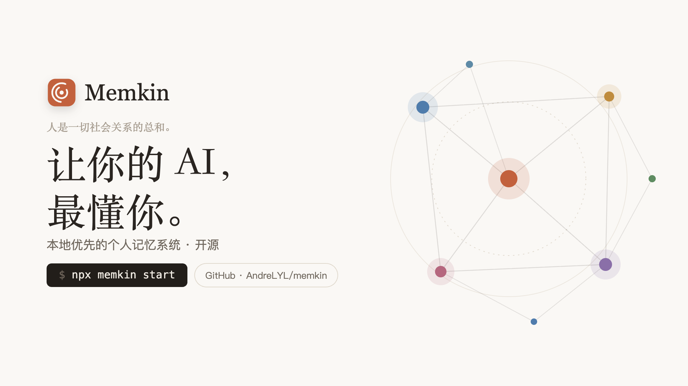
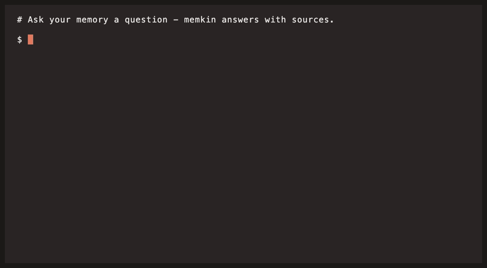

<p align="center">
  
</p>

<h1 align="center">An AI that finally knows you</h1>

<p align="center"><strong>Your AI agents forget everything between sessions. Memkin turns your Claude Code / Codex sessions — and your work chats, meetings, and email — into a private, local-first memory graph that any agent can tap over MCP.</strong></p>

<p align="center">
  <a href="README.md">简体中文</a> | English
</p>

<p align="center">
  <a href="LICENSE"></a>
  <a href="https://www.npmjs.com/package/memkin"></a>
  
  
  
</p>

<p align="center">
  
  <br>
  <em>Ask inside Claude Code — Memkin answers over MCP, with citations back to the source.</em>
</p>

---

## ⚡ 30-Second Quick Start

```bash
curl -fsSL https://raw.githubusercontent.com/AndreLYL/memkin/main/scripts/install.sh | sh
```

One command does it all: auto-installs a runtime → installs `memkin` globally → opens a browser setup wizard so you can drop in your LLM API key → on Save it runs as an **auto-starting background service** and automatically wires memory into whatever AI agents you already have installed (Claude Code, Codex, Hermes/OpenClaw).

> Just want to try it without a background service? `npx memkin start` is a one-command path too — with no config it opens the setup wizard, then starts the server and opens the web UI; with an existing config it just starts. Bare `npx memkin` is equivalent.

> Prerequisite: [Node.js](https://nodejs.org) >= 18 (the installer script installs it for you). The npm package and the command are both `memkin`.

## Run as a Background Service

The one-command installer ends by running `memkin up`, which registers Memkin as an auto-starting background daemon:

```bash
memkin status     # check whether the background service is running
memkin down       # stop the service and disable autostart
```

To uninstall completely:

```bash
memkin down && memkin uninstall && npm rm -g memkin
```

## Three Pillars

**🕸️ You are the sum of your working relationships**
Memory is not a pile of vector chunks. Signals are anchored to entities (people, projects, tools) and linked in a directed knowledge graph — you get answers *with context*: who, why, and what it relates to.

**🔒 Your data never leaves your machine**
Everything lives in an embedded PGLite database on your disk, with optional local embeddings via Ollama — zero cloud dependency. Dual-track privacy redaction (reversible / irreversible) scrubs sensitive data before anything is written.

**🤖 Agents read *and* write**
A core set of **15 high-intent MCP tools** (`query` / `recall` / `synthesize` / `prep_for_person` / `daily_report` …) lets any agent query your history and write new decisions and discoveries back. The more your agents work, the better your memory knows you.

## Give Your Coding Agent a Memory

The fastest way in: turn your Claude Code / Codex sessions into persistent, cross-session, cross-project memory.

```bash
# 1. Set up and launch (enable just the claude-code / codex sources in the wizard)
npx memkin start

# 2. Extract your session history into memory
npx memkin extract --source claude-code
npx memkin extract --source codex

# 3. Wire up your agent in one command (writes MCP config + a memory directive)
npx memkin install --agent claude-code
npx memkin install --agent codex

# 4. (Optional) Automatic recall hooks for Claude Code:
#    new sessions start pre-loaded with recent decisions / open tasks
npx memkin hooks install
```

Reopen your client and ask *"what did we decide on this project last week?"* — the agent answers from your local memory instead of making you re-explain.

Every coding session is full of decisions, discoveries, and dead-ends that evaporate the moment the session ends. Memkin's extraction pipeline distills them into structured signals, so the next session — in any agent — starts where the last one left off.

## How It Works

```
   AI-agent sessions              Work sources
 (Claude Code / Codex          (Feishu/Lark: chats,
    / OpenClaw)                email, calendar, docs)
        │                               │
        └───────────────┬───────────────┘
                        ▼   collect + extract (local LLM pipeline)
               ┌──────────────────┐
               │  Your core memory │  entities · decisions · tasks
               │   (PGLite, local) │  knowledge · timeline · graph
               └────────┬─────────┘
                        ▼  MCP · CLI · REST · Web UI
               Your agents know you
```

1. **Collect** — incremental collectors pull from your agent sessions (`~/.claude/projects/`, `~/.codex/`, `~/.openclaw/agents/`) and work sources, with per-source cursors and content-hash dedup.
2. **Extract** — an LLM pipeline (block building → two-layer noise filtering → signal extraction → privacy redaction) distills raw conversations into **7 core signal types**: entities, timeline events, decisions, tasks, discoveries, knowledge, and relationships (plus derived types like preferences and references).
3. **Store** — everything lands in an embedded PGLite (PostgreSQL) database on your machine: pages, chunks, tags, timeline, and a directed entity graph, searchable via hybrid FTS + vector retrieval (RRF fusion).
4. **Serve** — agents read and write the memory over MCP (stdio or Streamable HTTP); you browse it via CLI, REST API, or the built-in web UI (dashboard, timeline, force-directed graph, search).
5. **Consolidate** — a background memory-consolidation pass rotates tiers (hot → warm → cold), repairs dead links, and infers preferences, while a resident daemon keeps collecting on a schedule.

## MCP Tools

The MCP server exposes a default toolset headlined by **15 high-intent tools**, plus session/entity/identity helpers; 12 low-level legacy tools are hidden by default (`mcp.expose_legacy_tools: true` in `memkin.yaml`), for **36 tools** in total.

| Category | Tools |
|----------|-------|
| **Retrieval (high-intent)** | `query`, `search`, `get_page_context`, `timeline_feed`, `explore_graph` |
| **Synthesis (high-intent)** | `synthesize`, `recall` (cited, gap-aware composed answers with inline `[n]`), `prep_for_person` (passively inferred communication profile → goal-conditioned strategy), `daily_report` (cross-channel daily digest), `troubleshoot` (playbook-guided diagnosis) |
| **Write (high-intent)** | `put_page`, `add_timeline_entry`, `manage_links`, `manage_tags` |
| **Health (high-intent)** | `get_health` |
| **Session / entity** | `get_session_context`, `get_entity_profile`, `list_signals_by_entity` |
| **Identity (people)** | `link_person_alias`, `list_person_handles`, `remove_person_alias`, `merge_persons`, `recanonicalize_person` |
| **Feishu docs** | `ingest_feishu_doc` |
| **Legacy (hidden by default)** | `get_page`, `list_pages`, `get_chunks`, `add_link`, `remove_link`, `get_links`, `get_backlinks`, `traverse_graph`, `add_tag`, `remove_tag`, `get_tags`, `get_timeline` |

### Connect any MCP client

`memkin install` wires up **Claude Code · Claude Desktop · Cursor · Codex · Windsurf** automatically. Manual config for any other MCP client (stdio):

```json
{
  "mcpServers": {
    "memkin": {
      "command": "memkin",
      "args": ["serve", "--mcp"]
    }
  }
}
```

For remote access or sharing one memory across multiple clients, use Streamable HTTP: `memkin serve --mcp-http` (default `http://localhost:3928/mcp`).

## Data Sources

| Source | Location | What it captures |
|--------|----------|------------------|
| **Claude Code** | `~/.claude/projects/` | Agent conversations, decisions, discoveries, session logs |
| **Codex** | `~/.codex/` | OpenAI Codex CLI sessions |
| **OpenClaw Hermes** | `~/.openclaw/agents/` | Multi-agent sessions with automatic sub-agent discovery |
| **Feishu (Lark)** | API + lark-cli | Feishu/Lark integration for teams in China — 7 sources: DMs, group chats, email, calendar, tasks, docs, and message search |

> Using Feishu/Lark? The [Chinese README](README.md) covers the full Feishu setup — auth modes, DM vs. group capture paths, and doc summary cards. DingTalk and WeCom are on the roadmap.

## CLI at a Glance

| Command | Description |
|---------|-------------|
| `memkin start` | One-step launch: setup wizard if needed, then serve + auto-open browser (bare `memkin` is equivalent) |
| `memkin init` | Interactive config center for `memkin.yaml` (`--auto` / `--no-tui` / `--force` / `--web`) |
| `memkin extract` | Extract signals from a source (`--source claude-code\|codex\|hermes\|feishu\|all`, `--since`, `--dry-run`) |
| `memkin search <query>` | Search memory (hybrid FTS + vector / `--mode fts`) |
| `memkin serve` | Start HTTP API + Web UI / `--mcp` stdio / `--mcp-http` |
| `memkin install` | Wire Memkin into your AI clients (MCP config + memory directive) |
| `memkin hooks` | Claude Code auto-recall hooks (`install` / `install --write-back` / `uninstall`) |
| `memkin embed` | Generate embeddings for stale chunks |
| `memkin consolidate` | Run memory consolidation (tier rotation hot→warm / warm→cold) |
| `memkin export` / `import` | Bidirectional Obsidian sync (Markdown vault) |
| `memkin identity` | Person identity: aliases, merge, rename |
| `memkin doctor` | Diagnose configuration and connectivity |

## Ports & Security

| Service | Default port | Address |
|---------|--------------|---------|
| HTTP API + Web UI | `3927` | `http://localhost:3927` |
| MCP Streamable HTTP (`--mcp-http`) | `3928` | `http://localhost:3928/mcp` |

The server binds `127.0.0.1` (loopback only) by default. Exposing it on a LAN (`server.host: 0.0.0.0` or `memkin serve --host 0.0.0.0`) **requires an auth token** (`server.auth_token` or `MEMKIN_AUTH_TOKEN`), or the server refuses to start; every API request must then carry `Authorization: Bearer <token>`.

## Platform Support

Runs on **macOS / Linux / Windows** with the default embedded PGLite engine — works out of the box, zero external dependencies. The optional self-managed local Postgres engine (faster) is currently **macOS (arm64/x64) only**.

## Why Memkin

| | Memkin | Pure RAG / vector search | Note apps (Obsidian / Notion) |
|---|:---:|:---:|:---:|
| Local-first & private | ✅ | depends | depends |
| AI-agent sessions as a first-class source | ✅ | ❌ | ❌ |
| Agent-native: read **and** write over MCP | ✅ | ❌ | ❌ |
| Entity + relationship knowledge graph | ✅ | ❌ | manual |
| Structured signal extraction (not just chunks) | ✅ | ❌ | ❌ |
| Memory consolidation + scheduled-capture daemon | ✅ | ❌ | ❌ |
| Work-chat capture (Feishu/Lark) | ✅ | ❌ | manual |

> Pure RAG gives you vectors but no entities or relationships, so answers lack context. Note apps are powerful but rely on manual upkeep. Memkin keeps it local and agent-native.

## Tech Stack

TypeScript · Bun · PGLite (embedded PostgreSQL) · pgvector · Hono · React + Vite · @modelcontextprotocol/sdk · Vitest (1700+ tests)

## Development

```bash
bun run test              # full test suite
bun run typecheck         # type-check
bun run lint              # lint (Biome)
```

See [CONTRIBUTING.md](CONTRIBUTING.md) for the development workflow. Contributions welcome!

## Community & Support

- 🐛 Found a bug or have a feature request? [Open an issue](https://github.com/AndreLYL/memkin/issues).
- ⭐ If Memkin helps you, give it a star — it's the best way to support the project.

## License

Licensed under the [Apache License, Version 2.0](LICENSE).
