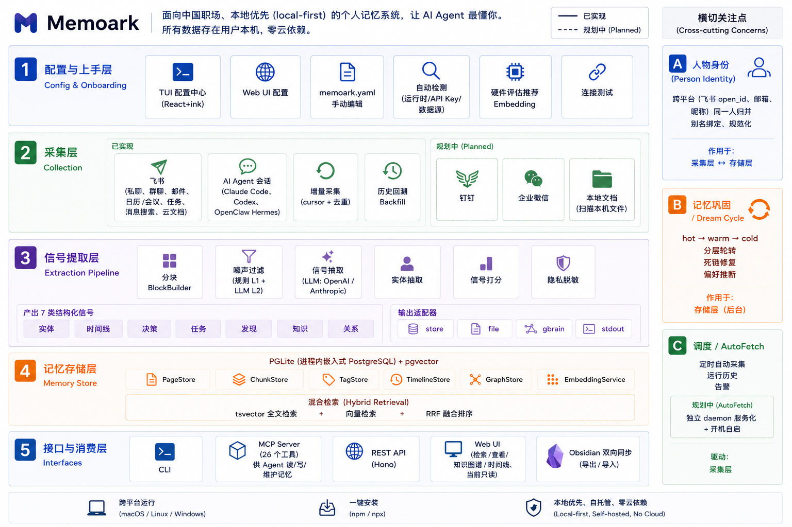
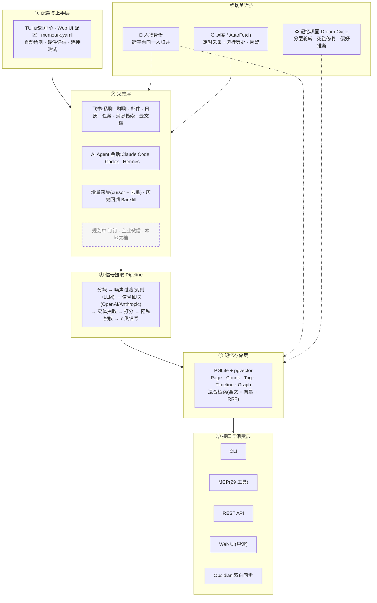

<p align="center">
  <h1 align="center">Memoark</h1>
  <p align="center"><em>人是一切社会关系的总和。</em></p>
  <p align="center"><strong>一个面向个人工作场景的、本地优先的记忆系统 —— 把你的私聊、群聊、邮件、文档、会议，沉淀成本地私有的个人记忆，让你的 AI Agent 最懂你。</strong></p>
</p>

<p align="center">
  简体中文 | <a href="README.en.md">English</a>
</p>

<p align="center">
  <a href="LICENSE"></a>
  <a href="https://www.npmjs.com/package/@andre.li/memoark"></a>
  
  
  
</p>

<p align="center">
  
  <br>
  <em>把你的工作变成一张活的知识图谱 —— 人、决策、任务、知识，全部连起来。</em>
</p>

<!-- TODO(demo): 在此处替换为一段 8~12 秒的演示 GIF —— 在 Claude Code 里向 Memoark 提问，
     Agent 通过 MCP 召回一条飞书会议决策 + 关联任务。脚本见 docs（hero demo）。
     研究表明，"展示产品真正在工作"的 GIF 是 README 转化率最高的单一要素。 -->

---

## 痛点

你的工作记忆有两个家，而你的 AI Agent 一个都够不着。

- **飞书**承载你的工作关系网 — 私信、群聊、邮件、会议、文档、任务。这是你*在做什么*、*和谁一起做*。
- **AI Agent**（Claude Code、Codex、OpenClaw）承载你的构建过程 — 每次编程会话里的决策、发现和踩过的坑。

但每次打开新的 Agent 会话，它都一无所知。你得重新解释你是谁、项目是什么、上周决定了什么、为什么。上下文明明*就在某处* — 埋在你再也不会翻的聊天记录和会话日志里。

**你不是记忆力差，你是信息碎片化 — 而你的 Agent 每天都在为此买单。**

## 解决方案

Memoark 是一个**面向中国职场、本地优先的个人记忆系统**。中国职场的工作发生在飞书、钉钉、企业微信里 —— 我们把这些工具里的私聊、群聊、邮件、会议、文档,连同你与 AI Agent 的会话,一起提取成结构化信号（实体、决策、任务、发现、知识、关系），汇入你自己机器上一个统一、可搜索的知识图谱，再通过 **MCP** 把这份记忆喂回给任何 Agent。

> 一期(MVP)聚焦**飞书**全量采集;**钉钉、企业微信**等更多中国职场工具在路线图上(见下方)。

结果是：你的 Agent 既**写入**又**读取**同一份记忆 —— 让 Claude Code、Codex 以及任何 MCP 客户端，终于*懂你和你的工作*。

```
        飞书工作流                  AI Agent 会话
   (私信 / 群聊 / 邮件             (Claude Code / Codex
    会议 / 文档 / 任务)             / OpenClaw)
           │                               │
           └───────────────┬───────────────┘
                           ▼   采集 + 抽取（本地）
                  ┌──────────────────┐
                  │   你的核心记忆    │  实体 · 决策 · 任务
                  │  (PGLite, 本地)   │  知识 · 时间线 · 图谱
                  └────────┬─────────┘
                           ▼  MCP
                   你的 Agent 懂你
                           │
                           └──── Agent 用得越多，记忆越懂你 ───┘
```

> "我昨天在飞书和同事讨论了一个方案，今天在 Claude Code 里实现了一部分，下周还有个评审会。"
>
> Memoark 自动把这三件事串起来 —— 跨平台、跨时间 —— 并在你需要时把完整脉络交给 Agent。

## 三大支柱

**🔒 本地优先，绝对私密**
数据永远不离开你的机器。PGLite 嵌入式数据库存储一切，可选 Ollama 本地向量嵌入，无任何云依赖。双轨隐私脱敏（可逆 / 不可逆）在写入前清洗敏感信息。

**🕸️ 实体知识图谱，而非一堆向量分块**
信号被锚定到实体（人、项目、工具）并以有向图相互链接。你得到的是有上下文的答案 —— 谁、为什么、和什么相关 —— 而不是孤立的相似文本片段。

**🤖 MCP 原生 + 飞书采集**
**29 个内置 MCP 工具**让任何 Agent 既查询又写回你的记忆。飞书全量采集（7 个源）把你真实的工作 —— 需求、方案、团队决策 —— 变成一等数据源，这是纯 RAG 和笔记工具都做不到的。

## 核心特性

**🛰️ 飞书全量采集**
你的工作在飞书里。Memoark 覆盖 **7 个源** —— 私信、群聊、邮件、日历、文档、任务、消息搜索 —— 把你的工作关系网变成结构化记忆。文档采集会生成可升级的"摘要卡片"（DocSource v2）。

**🤖 让 Agent 懂你（MCP）**
把 Memoark 作为任何 MCP Agent 的记忆层 —— Claude Code、Cursor、Claude Desktop、Windsurf。**29 个内置工具**让 Agent 查询历史、读取实体页面、写回新知识。Agent 既是记忆的生产者，也是消费者。

**🧠 AI 驱动信号提取**
LLM 驱动的 Pipeline 从原始对话中提取 7 类结构化信号：实体、时间线、决策、任务、发现、知识、关系。

**🔍 混合语义搜索**
全文搜索（tsvector，支持中文）+ 向量检索（pgvector），通过 RRF（Reciprocal Rank Fusion）融合排序。支持自然语言提问。

**♻️ 记忆巩固（Dream Cycle）**
后台巩固任务自动做分层轮转（hot → warm → cold）、死链修复、偏好推断 —— 让记忆随时间自我整理。

**⏰ 常驻 Daemon + 定时采集**
内置守护进程按计划自动采集各数据源，带运行历史与告警，让记忆持续保持新鲜。

**🔗 Obsidian 双向同步**
把记忆页面导出为 Obsidian vault（Markdown），编辑后再导入回来。

**🕸️ 知识图谱 + Web UI**
看见人、项目、决策之间的关联。内置 Web UI 提供 Dashboard、时间线、力导向知识图谱和搜索。

**🔌 REST API**
基于 Hono 的 HTTP API，暴露所有存储操作。

## 功能清单

完整的能力清单（✅ = 已实现并随包发布）。

### 📥 数据采集
- ✅ 飞书群聊（OpenAPI chat/message）
- ✅ 飞书私信 / 最近会话（lark-cli `message_search`，user 态）
- ✅ 飞书邮件
- ✅ 飞书日历事件
- ✅ 飞书任务
- ✅ 飞书文档摘要卡片（DocSource v2：pointer 卡 → 触发后升级完整卡）
- ✅ Claude Code 会话（`~/.claude/projects/`）
- ✅ Codex CLI 会话（`~/.codex/`）
- ✅ OpenClaw Hermes 多 Agent 会话（`~/.openclaw/agents/`，自动发现子 Agent）
- ✅ 增量采集：按源 cursor + 内容 hash 去重
- ✅ 历史回填（backfill）：覆盖范围统计、启动 / 取消 / 重置

### 🧠 信号提取 Pipeline
- ✅ 采集 → 去重 → 分块（Block Builder）→ 噪声过滤 → 信号提取 → 隐私脱敏
- ✅ 双层噪声过滤：L1 规则 + L2 LLM 打分
- ✅ 7 类结构化信号：实体、时间线、决策、任务、发现、知识、关系
- ✅ LLM 提供方：OpenAI / Anthropic（含 mock，便于测试）
- ✅ 信号打分（signal scoring）与实体抽取
- ✅ JSON / Markdown 两种输出格式
- ✅ 输出适配器：store（PGLite）/ file / gbrain / stdout
- ✅ 来源溯源（provenance）：每条信号可追溯到原始消息

### 🔒 隐私与安全
- ✅ 写入前脱敏，数据全程本地
- ✅ 双轨模式：可逆（reversible）/ 不可逆（irreversible）
- ✅ 内置脱敏：手机号、身份证、银行卡，可自定义替换符
- ✅ 配置中心 API key 全程掩码显示

### 🗄️ 存储与检索
- ✅ PGLite 嵌入式 PostgreSQL（进程内，零外部依赖）
- ✅ pgvector 向量检索
- ✅ tsvector 全文检索（simple 分词器，支持中文）
- ✅ RRF 混合搜索（全文 + 向量融合排序），compiled_truth / backlink 加权
- ✅ 递归文本分块（300 词 / 50 词重叠），嵌入复用与过期检测
- ✅ 向量嵌入：OpenAI / Ollama（本地）

### 🕸️ 知识图谱
- ✅ 有向链接图，带链接类型与上下文
- ✅ BFS 图遍历（可控深度 / 方向）
- ✅ 反向链接（backlinks）
- ✅ 实体锚定：信号挂到人 / 项目 / 工具
- ✅ 实体画像聚合（profile：信号 + 时间线）

### 👤 人物身份管理
- ✅ 身份解析与规范化（canonicalize）
- ✅ 别名 / handle 绑定（飞书 open_id、邮箱、姓名、昵称、slug）
- ✅ 强 / 弱 绑定强度
- ✅ 人物合并（merge，自动重指向链接 / 时间线 / 标签 / 别名）
- ✅ 重命名规范 slug（修正错误规范化）

### ♻️ 记忆生命周期 & 常驻服务
- ✅ 记忆巩固（dream cycle）：hot → warm → cold 分层轮转
- ✅ 死链修复
- ✅ 偏好推断（从历史中归纳 preference）
- ✅ 常驻 Daemon：按源定时采集、调度、运行历史、告警

### 🔗 同步与互通
- ✅ Obsidian 双向同步（导出 vault / 导入回库）
- ✅ MCP stdio 服务器（29 个工具）
- ✅ REST API（Hono，覆盖页面 / 搜索 / 图谱 / 标签 / 时间线 / 嵌入 / 提取 / 溯源 / 事件流）

### 🖥️ Web UI（React + Vite）
- ✅ Dashboard 概览
- ✅ 时间线视图（feed）
- ✅ 力导向知识图谱
- ✅ 搜索界面
- ✅ 实体 / 页面详情
- ✅ 浏览器内配置编辑 + 引导式 setup 向导

### ⚙️ 配置与上手
- ✅ 交互式配置中心（全屏 TUI，React + ink）
- ✅ 线性问答向导 fallback（`--no-tui`）/ 全自动（`--auto`）
- ✅ 自动检测：运行时、API key、已有数据源
- ✅ 硬件评估 → 推荐本地 / 远程 Embedding
- ✅ 实时连接测试（LLM / Embedding API key 与连通性）
- ✅ `memoark doctor` 环境诊断

## 适配的 MCP 客户端

Memoark 是标准 MCP stdio 服务器，可接入任何 MCP 客户端：

**Claude Code** · **Cursor** · **Claude Desktop** · **Windsurf** · 以及任何兼容 MCP 的 Agent。

## 使用场景

> Memoark 回答的不是"我知道什么"，而是"**我该怎么做**"——每个场景的输出都是**带 `[n]` 引用、可溯源的行动建议**。

**🌟 见人之前，先想好怎么沟通（Hero）**
*"我明天要见张总，谈续约涨价，该注意什么？"* —— `prep_for_person` 从你和张总的真实互动里**被动推断**出沟通画像（直接还是委婉、看数据还是看关系、有哪些雷区），结合本次目标给出沟通建议，并提醒缺口（*"你已 18 天没有他的新信息，画像可能过时"*）。零问卷，画像永不出本机。

**📋 一句话生成跨渠道日报**
*"帮我生成今天的日报"* —— `daily_report` 把今天散落在私聊、群聊、邮件、妙记会议纪要、日历里的信号，聚合成 7 段：今日决策 / 推进中 / 我的待办 / 待回复·被@ / 人脉动态 / 明日提醒。会议纪要里点到你名字的待办，自动进"我的待办"。

**🔧 按手册排查问题**
*"智驾为什么无法激活？"* —— `troubleshoot` 沿 playbook 的排查链给出有序步骤，并解释每一步不同结果代表什么。排查手册可以手动沉淀，也能从你帮人排查的对话里自动抽取成草稿。

**⚡ 让 Agent 几秒接手一个项目**
*"memoark 这个项目现在进展如何？"* —— `get_session_context` 直接拉出聚合的决策、待办和最近时间线，无需你重新解释。

**🔎 回忆某人、某件事**
*"我上周和这位同事聊了什么？"* —— 把飞书私信、会议、后续任务串成一个带引用的答案。

## 为什么选 Memoark

| | Memoark | 纯 RAG / 向量检索 | 笔记工具（Obsidian / Notion） | GBrain | OpenHuman |
|---|:---:|:---:|:---:|:---:|:---:|
| 本地优先 & 私密 | ✅ | 视情况 | 视情况 | ✅ | ✅ |
| 开源 | ✅ | 不一定 | 部分 | 部分 | ✅ |
| 飞书工作采集（私信/群聊/邮件/会议/文档/任务） | ✅ | ❌ | 手动 | ❌ | ❌ |
| 把 AI Agent 会话作为数据源 | ✅ | ❌ | ❌ | ✅ | ✅ |
| Agent 原生：通过 MCP 既读**又**写 | ✅ | ❌ | ❌ | ✅ | 部分 |
| 实体 + 关系知识图谱 | ✅ | ❌ | 手动 | ✅ | 部分 |
| 结构化信号提取（不只是分块） | ✅ | ❌ | ❌ | ✅ | ✅ |
| 记忆巩固 + 定时采集 daemon | ✅ | ❌ | ❌ | 部分 | 部分 |

> 纯 RAG 只有向量、没有实体和关系，回答缺乏上下文；笔记工具强大但依赖手动维护。Memoark 保持本地、Agent 原生 —— 并把飞书工作作为一等数据源。

## 快速开始

### 一键启动（推荐）

```bash
# 免安装直接运行 —— 没有配置会自动引导 setup 向导，完成后自动起服务并打开浏览器
npx @andre.li/memoark start

# 不带任何子命令也等效于 start
npx @andre.li/memoark
```

`memoark start` 是单步上手路径：检测到没有 `memoark.yaml` 时先拉起浏览器 setup 向导，配置完成后立即启动 HTTP 服务并自动打开浏览器。

> npm 包名为 `@andre.li/memoark`（作用域包），但命令名仍是 `memoark`。

### 端口一览

| 服务 | 默认端口 | 地址 |
|------|---------|------|
| HTTP API + Web UI | `3927` | `http://localhost:3927` |
| MCP Streamable HTTP（`--mcp-http`） | `3928` | `http://localhost:3928/mcp` |

### 30 秒上手（手动配置）

```bash
# 只想先生成配置、不立即起服务 —— 启动交互式配置中心
npx @andre.li/memoark init
```

### 前置条件

- [Node.js](https://nodejs.org) >= 18（用 `npx` / `npm` 安装时）
- （可选）[Ollama](https://ollama.ai) 本地嵌入

### 安装方式

```bash
# 方式 A：免安装直接运行
npx @andre.li/memoark --help

# 方式 B：全局安装,得到 memoark 命令
npm install -g @andre.li/memoark

# 方式 C：从源码安装（开发）
git clone https://github.com/AndreLYL/memoark.git
cd memoark
bun install
npm link          # 注册 memoark 全局命令
```

### 初始化配置

`memoark init` 启动一个**交互式配置中心**（基于 React + ink 的全屏 TUI），让你零手写地生成 / 编辑 `memoark.yaml`：

```bash
memoark init
```

**配置中心特性：**
- 📋 **分区编辑**：Overview、LLM、Embedding、数据源、隐私、分块（Block Builder）等分区
- ⌨️ **键盘操作**：↑/↓ 或 Tab 切换字段，Enter 编辑，Ctrl+S 保存，q / Esc 退出（有改动会自动保存）
- 🔌 **实时连接测试**：编辑 LLM / Embedding 时自动校验 API key 与连通性
- 💡 **智能推荐**：根据本机硬件推荐本地（Ollama）或远程（OpenAI）Embedding
- 🔒 **密钥脱敏**：API key 始终掩码显示
- 🧭 **自动检测**：识别已有数据源（Claude Code、Codex、Hermes）并注册 `memoark` 命令

**运行模式：**

| 命令 / 环境 | 行为 |
|---|---|
| `memoark init`（TTY 终端下） | 全屏 TUI 配置中心 |
| `memoark init --no-tui` | 逐项问答式向导（线性 fallback） |
| `memoark init --auto` | 全自动，无提示，用检测到的默认值生成 |
| `memoark init --force` | 覆盖已有配置 |
| `MEMOARK_NO_TUI=1` | 强制禁用 TUI（非 TTY 环境也会自动 fallback） |

> `memoark config init` 与 `memoark init` 等价。飞书等少数高级配置目前需直接编辑 `memoark.yaml`（见下方飞书章节）。

### 检查环境

```bash
memoark doctor
```

### 运行提取

```bash
# 从 Claude Code 提取
memoark extract --source claude-code

# 从 Codex 提取
memoark extract --source codex

# 从所有启用的数据源提取
memoark extract --source all

# 干跑模式（不调用 LLM，仅扫描数据量）
memoark extract --source claude-code --dry-run
```

### 飞书私聊/群聊提取

飞书消息有两条不同路径：

- `sources.feishu.sources.messages` 使用 OpenAPI chat/message 接口，适合明确群聊 `chat_id` 或自动发现到的群聊。
- `sources.feishu.sources.message_search` 使用 `lark-cli im +messages-search`，适合 user-mode 下搜索最近私聊和群聊。私聊机器人对话通常需要这条路径，否则最近三天会明显少数据。

本地需要先完成 lark-cli 的飞书用户态登录，并在 `memoark.yaml` 打开 `message_search`：

```yaml
llm:
  provider: openai
  model: gpt-4.1-mini
  api_key: ${TOKENFREE_API_KEY}

sources:
  feishu:
    enabled: true
    auth_mode: user
    app_id: ${FEISHU_APP_ID}
    app_secret: ${FEISHU_APP_SECRET}
    sources:
      messages:
        enabled: true
        chat_ids: []
        lookback_days: 3
      message_search:
        enabled: true
        chat_types:
          - p2p
          # - group
        lookback_days: 3
        page_size: 50
```

然后运行：

```bash
bun src/cli.ts extract --source feishu --adapter store --since 3d
```

`--dry-run` 只验证采集数量，不写数据库、不提交 cursor：

```bash
bun src/cli.ts extract --source feishu --adapter store --since 3d --dry-run
```

### 飞书文档摘要卡片（DocSource v2）

Memoark 可以把飞书文档采集为可升级的"摘要卡片"：先建立轻量的 pointer 卡，被触发后再升级为完整摘要卡。

```bash
# 扫描飞书文档，建立 pointer 卡，并把触发的文档升级为完整卡
memoark docs sync

# 查看各类文档卡片数量
memoark docs status

# 重试某个失败文档的完整卡提取（或 --all-failed 重试全部）
memoark docs retry <doc_token>
memoark docs retry --all-failed
```

Agent 也可以通过 MCP 工具 `ingest_feishu_doc`（传入文档 URL 或 token）直接采集单篇文档。

### 增量状态与重建

Memoark 的增量状态分两层：

- 数据库：默认在 `~/.memoark/data`，保存提取后的页面、chunk、关系和时间线。
- 运行状态：当前仓库的 `.memoark/cursors.yaml` 和 `.memoark/dedup.jsonl`，分别保存源 cursor 和消息去重 hash。

正常增量运行不要手动删这些文件。需要删除某个源的过期提取结果并重跑时，用内置命令，它会先备份数据库和 `.memoark`：

```bash
# 先预览会删除多少内容
bun src/cli.ts store purge-source feishu

# 确认后清理飞书结果、飞书 cursor，并重置旧格式 dedup
bun src/cli.ts store purge-source feishu --yes

# 再跑最近三天
bun src/cli.ts extract --source feishu --adapter store --since 3d
```

旧版 `dedup.jsonl` 只记录 hash，没有记录来源平台，所以彻底重跑飞书时默认会备份后清空整个 dedup。后续增量会重新建立去重状态。

### 搜索记忆

```bash
# 混合搜索（全文 + 向量）
memoark search "认证中间件决策"

# 仅全文搜索
memoark search "JWT token" --mode fts
```

### 启动服务器

```bash
# HTTP API + Web UI（默认 http://localhost:3927）—— 启动后自动打开浏览器
memoark serve

# 不想自动开浏览器（比如在远程 / 服务器上跑）
memoark serve --no-open

# MCP stdio（AI Agent 本地直连 — Claude Code、Cursor 等，不开浏览器）
memoark serve --mcp

# MCP Streamable HTTP（远程 / 多客户端，默认 http://localhost:3928/mcp，不开浏览器）
memoark serve --mcp-http
```

> 缺少 `memoark.yaml` 时 `serve` 会提示先用 `memoark start` 一步配置 + 启动，或 `memoark init --web` 先完成配置。

### 接入你的 Agent（MCP）

**一键接入（推荐）**：`memoark install` 会自动把 MCP 配置 + 一份极简「记忆指令」写进你的 AI 客户端（**默认全局**，对所有项目生效），支持 **Claude Code · Claude Desktop · Cursor · Codex · Windsurf**：

```bash
memoark install                      # 探测本机已装的客户端并接入
memoark install --agent claude-code  # 指定单个客户端
memoark install --dry-run            # 先预览会改哪些文件，不写盘
memoark uninstall                    # 干净移除（幂等）
```

装完重开客户端即可——之后你问「X 上周跟我聊了啥」「这个项目推进到哪了」，Agent 会按注入的「记忆指令」**主动来 Memoark 检索**（cheap-first：先 `search` 零成本关键词，不够再 `query`/`recall`），而不是凭空作答。

> Claude Desktop 没有规则文件，靠 MCP server 的 `instructions` 字段兜底。也可按下面的方式手动配置。

Memoark 提供两种 MCP 接入方式，按场景选：

- **stdio（`--mcp`）** —— 本地直连，Agent 把 `memoark` 作为子进程拉起，零网络配置，单机单客户端首选。
- **Streamable HTTP（`--mcp-http`）** —— 走 HTTP（默认 `3928`），适合远程接入或多个客户端共享同一份记忆。

让任何 MCP 客户端指向 Memoark，即可读写你的记忆。以 Claude Code 为例（stdio 本地直连）：

```json
{
  "mcpServers": {
    "memoark": {
      "command": "memoark",
      "args": ["serve", "--mcp"]
    }
  }
}
```

然后就可以让 Agent *"在我的记忆里搜一下 auth 重构的决策"* 或 *"项目 X 还有哪些未完成任务？"* —— 它会从你的本地记忆作答。

### 浏览 Web UI

```bash
cd web
bun install
bun run dev        # Dashboard、时间线、知识图谱、搜索
```

## 架构

Memoark 是 **5 层纵向数据流 + 3 个横切关注点**。数据自上而下流动:数据源被采集、提取成信号、存入本地记忆,再由底层接口对外读写;**人物身份**与**记忆巩固**、**调度**则横切贯穿其间。

<p align="center">
  
</p>

<details>
<summary>📐 查看可编辑的 Mermaid 源码</summary>



</details>

### 分层说明

| 层 | 职责 |
|----|------|
| **① 配置与上手层** | TUI 配置中心(React + ink)、Web UI 配置、`memoark.yaml` 手编;自动检测运行时 / API key / 数据源,硬件评估推荐 Embedding,实时连接测试 |
| **② 采集层** | 飞书(私聊 / 群聊 / 邮件 / 日历 / 任务 / 消息搜索 / 云文档)、AI Agent 会话(Claude Code / Codex / Hermes);增量采集(per-source cursor + 内容去重)、历史回溯 Backfill。**规划中**:钉钉、企业微信、本地文档 |
| **③ 信号提取 Pipeline** | 分块 → 噪声过滤(L1 规则 + L2 LLM)→ 信号抽取(OpenAI / Anthropic)→ 实体抽取 → 打分 → 隐私脱敏;产出 7 类信号,经输出适配器(store / file / gbrain / stdout)落库 |
| **④ 记忆存储层** | PGLite(进程内嵌入式 PostgreSQL)+ pgvector;Page / Chunk / Tag / Timeline / Graph 存储;混合检索(tsvector 全文 + 向量 + RRF) |
| **⑤ 接口与消费层** | CLI、MCP Server(29 工具,Agent 读 / 写 / 维护)、REST API(Hono)、Web UI(检索 / 查看 / 图谱 / 时间线,**当前只读**)、Obsidian 双向同步 |

**横切关注点(贯穿多层,而非独立流水线层):**

- **🧬 人物身份** — 贯穿「采集 ↔ 存储」:跨平台(飞书 open_id、邮箱、昵称)识别并归并同一个人,别名绑定、规范化。这是「社会关系总和」的地基。
- **♻️ 记忆巩固(Dream Cycle)** — 后台旁路作用于存储层:hot → warm → cold 分层轮转、死链修复、偏好推断,让记忆自我整理。
- **⏰ 调度 / AutoFetch** — 后台驱动采集层:定时自动采集、运行历史、告警。*(当前运行于 `serve` 进程内;独立 daemon 服务化 + 开机自启见路线图。)*

> 运行平台:macOS / Linux / Windows · 一键安装(npm / npx)· 本地优先、自托管、零云依赖。

### 信号类型

| 信号类型 | 说明 | 示例 |
|---------|------|------|
| **实体** | 人物、项目、工具、概念 | `project/memoark`, `tool/claude-code` |
| **时间线** | 关键事件及时间戳 | "2026-05-19: 完成多平台采集器重构" |
| **决策** | 架构选型、技术决策及其理由 | "选择 PGLite 作为嵌入式 PostgreSQL 方案" |
| **任务** | 待办事项及状态追踪 | `[open] 实现 token 自动刷新` |
| **发现** | 技术洞察、bug 根因、edge case | "UUID v4 不可按字典序排序" |
| **知识** | 可复用的事实性知识 | "PGLite 通过 WASM 在进程内运行完整 Postgres" |
| **关系** | 实体间的依赖、引用、协作 | `project/memoark --[depends_on]--> tool/pglite` |

### 存储层

| 组件 | 说明 |
|------|------|
| **PageStore** | Wiki 风格页面，YAML frontmatter，CRUD |
| **ChunkStore** | 递归文本分块（300 词，50 词重叠），嵌入复用 |
| **SearchEngine** | tsvector 全文搜索 + pgvector 向量搜索，RRF 融合排序 |
| **GraphStore** | 有向链接图，BFS 遍历，链接类型过滤，反向链接 |
| **TagStore** | 页面标签，冲突安全 upsert |
| **TimelineStore** | 按时间排序的条目，去重 |
| **EmbeddingService** | OpenAI / Ollama 批量嵌入，过期 chunk 检测 |

## MCP 工具

Memoark 的 MCP 服务器暴露 **29 个工具**，覆盖检索、合成、页面 CRUD、图谱、标签、时间线、身份管理与飞书文档采集。高层工具优先：

| 类别 | 工具 |
|------|------|
| **检索（高层）** | `query`、`get_session_context`、`get_entity_profile`、`list_signals_by_entity` |
| **合成** | `synthesize`、`recall`（带 `[n]` 引用的成段答案 + gap 分析）、`prep_for_person`（人物沟通画像 → 目标条件化的沟通策略，被动推断·零问卷·本地优先·伦理护栏）、`daily_report`（跨渠道 7 段日报）、`troubleshoot`（沿 playbook 排查链一次性排查） |
| **搜索** | `search` |
| **页面 / 内容** | `get_page`、`put_page`、`list_pages`、`get_chunks` |
| **图谱** | `add_link`、`remove_link`、`get_links`、`get_backlinks`、`traverse_graph` |
| **标签** | `add_tag`、`remove_tag`、`get_tags` |
| **时间线** | `add_timeline_entry`、`get_timeline` |
| **身份（人物）** | `link_person_alias`、`list_person_handles`、`remove_person_alias`、`merge_persons`、`recanonicalize_person` |
| **飞书文档** | `ingest_feishu_doc` |
| **健康** | `get_health` |

## CLI 命令

| 命令 | 说明 |
|------|------|
| `memoark start` | 一键启动：无配置自动引导 setup，完成后 serve + 自动开浏览器（裸跑 `memoark` 等效） |
| `memoark init` | 交互式配置中心，生成 / 编辑 `memoark.yaml`（`--auto` / `--no-tui` / `--force` / `--web`） |
| `memoark extract` | 从数据源提取信号 |
| `memoark search <query>` | 搜索记忆（混合 / `--mode fts`） |
| `memoark embed` | 为未嵌入的 chunk 生成向量 |
| `memoark serve` | 启动 HTTP API（自动开浏览器，`--no-open` 关闭）/ `--mcp` stdio / `--mcp-http` |
| `memoark consolidate` | 运行记忆巩固（分层轮转 hot→warm / warm→cold） |
| `memoark export` | 把记忆页面导出为 Obsidian vault（Markdown） |
| `memoark import` | 把 Obsidian vault 导回 Memoark |
| `memoark docs` | 飞书文档摘要卡片：`sync` / `status` / `retry` |
| `memoark identity` | 人物身份管理：别名、合并、重命名 |
| `memoark sources` | `list` 列出 / `test <name>` 测试数据源 |
| `memoark doctor` | 诊断配置和连通性 |
| `memoark config` | `init`（等价 `memoark init`）/ `edit`（浏览器 UI 编辑） |

### `memoark extract` 选项

```bash
memoark extract \
  --source <name>              # claude-code, codex, hermes, feishu, all
  --format json|markdown       # 输出格式，默认 json
  --adapter store|file|gbrain|stdout  # 输出目标，默认 store
  --since <date>               # 只处理此日期之后的消息
  --limit <n>                  # 限制消息数
  --dry-run                    # 测试模式
```

## 配置

### `memoark.yaml`

```yaml
# 隐私配置
privacy:
  enabled: true
  mode: reversible           # reversible（可逆）| irreversible（不可逆）
  redact_phone: true
  redact_id_card: true
  redact_bank_card: true
  replacement: "[REDACTED]"

# LLM（信号提取用）
llm:
  provider: openai
  model: gpt-4o-mini
  api_key: ${OPENAI_API_KEY}

# 分块配置
block_builder:
  block_gap_minutes: 30
  max_block_tokens: 4000
  max_block_messages: 100

# 数据源
sources:
  claude-code:
    enabled: true
  codex:
    enabled: true
  hermes:
    enabled: true

# 存储（PGLite）
store:
  data_dir: ~/.memoark/data

# 嵌入
embedding:
  provider: openai           # openai | ollama
  model: text-embedding-3-large
  dimensions: 1536
  api_key: ${OPENAI_API_KEY}

# 服务器
server:
  http_port: 3927
```

## 支持的数据源

| 数据源 | 路径 | 说明 |
|--------|------|------|
| **飞书（Lark）** | API + lark-cli | 核心工作源 —— 7 个源：群聊、私信、邮件、日历、文档、任务、消息搜索 |
| **Claude Code** | `~/.claude/projects/` | Claude Code Agent 对话记录 |
| **Codex** | `~/.codex/` | OpenAI Codex CLI 会话 |
| **Hermes** | `~/.openclaw/agents/` | OpenClaw Hermes Agent 会话 |

> 飞书优先：它承载的是工作本身 —— 需求讨论、技术方案、团队决策。私信和最近会话需要先完成 `lark-cli` 用户态登录并启用 `message_search`（详见上方配置）。

## 路线图

### Phase 1 — 信号提取（已完成）

- [x] 多平台采集器（Claude Code、Codex、Hermes、飞书）
- [x] LLM 驱动的噪声过滤和信号提取
- [x] 7 类信号：实体、时间线、决策、任务、发现、知识、关系
- [x] 双轨隐私脱敏（可逆 + 不可逆）
- [x] JSON 和 Markdown 输出格式

### Phase 2 — 存储 & 服务器（已完成）

- [x] PGLite 嵌入式 PostgreSQL + pgvector
- [x] PageStore、ChunkStore、TagStore、TimelineStore、GraphStore
- [x] 全文搜索（simple 分词器，支持中文）+ 向量搜索
- [x] RRF 混合搜索
- [x] EmbeddingService（OpenAI / Ollama）
- [x] StoreAdapter — Pipeline 直接写入 PGLite
- [x] Hono REST API
- [x] MCP 服务器（29 个 stdio 工具）
- [x] CLI serve、search、embed 命令

### Phase 3 — Web UI（已完成）

- [x] Dashboard
- [x] 时间线视图
- [x] 知识图谱可视化（力导向）
- [x] 搜索界面
- [x] 实体 / 页面详情

### Phase 4 — 巩固与常驻服务（已完成）

- [x] 记忆巩固（dream cycle）：分层轮转、死链修复、偏好推断
- [x] 常驻 Daemon + 定时采集（调度、运行历史、告警）
- [x] 人物身份管理（别名、合并、重命名）
- [x] 飞书文档摘要卡片（DocSource v2）
- [x] Obsidian 双向同步（export / import）

### Phase 5 — 常驻自托管（进行中 · MVP）

- [ ] 独立 daemon 服务化 + 开机自启（systemd / launchd / Windows 服务）—— "配置一次，后台免维护"
- [ ] Agent Hook 机制：会话结束 / 关键决策后自动读写记忆

### Phase 6 — 更多中国职场数据源（规划中）

- [ ] 钉钉
- [ ] 企业微信
- [ ] 微信聊天记录
- [ ] 本地文档源（扫描本机文件，社区驱动 · 低优先）

### Phase 7 — 上下文感知提取 & 问答（进行中）

- [x] 合成层（基础）：`synthesize` / `recall` —— 带 `[n]` 引用的成段答案 + gap 分析、意图模板框架、逐 scope 缓存
- [x] **人物沟通画像（Hero）**：`prep_for_person(person, goal?)` —— 从真实互动**被动推断**沟通画像（行为层零-LLM 统计 + 行为四象限特质层 + 关系层 + 四色外壳），给出**目标条件化、带 `[n]` 引用**的沟通策略。零问卷·本地优先·伦理护栏（建议非操纵），默认关闭、逐人 opt-in
- [x] **跨渠道日报**：`daily_report(date?)` —— 把今天散落在私聊/群聊/邮件/妙记纪要/日历的信号聚合成 7 段日报（今日决策 / 推进中 / 我的待办 / 待回复被@ / 人脉动态 / 明日提醒）；妙记纪要可抽出 `decisions` 与带 owner 的 `action_items`（owner 是我的进"我的待办"）
- [x] **排查 Playbook**：`troubleshoot(query)` —— 沿 playbook 的排查链（`precedes`）给出有序步骤并解释每步结果含义；分层树（`part_of`）组织问题域,手册可手动沉淀或从排查对话自动抽取（草稿待确认）
- [x] **检索质量**：best-chunk-per-page 池化（以最强证据露出）、写入时零-LLM 自布线（`[[slug]]`/`[[rel:slug]]` 建图边）、规则式 query 改写
- [ ] ContextBuffer —— 跨 block 共享上下文
- [ ] 加权准入评分（替换二元噪声过滤）
- [ ] NarrativeAssembler —— 按实体聚合叙事
- [ ] 自然语言问答

### Phase 8 — Web UI 增强（规划中）

- [ ] 记忆编辑（当前为只读）
- [ ] 审计视图（信号溯源可视化）

## 技术栈

| 层 | 技术 |
|----|------|
| 语言 | TypeScript |
| 运行时 | Bun |
| 数据库 | PGLite（嵌入式 PostgreSQL） |
| 向量搜索 | pgvector |
| 嵌入 | OpenAI / Ollama |
| Web 框架 | Hono |
| Web UI | React + Vite |
| MCP | @modelcontextprotocol/sdk |
| Linter | Biome |
| 测试 | Vitest（1000+ 测试） |

## 开发

```bash
bun run test              # 全量测试
bun run test:watch        # 监听模式
bun run typecheck         # 类型检查
bun run lint              # 代码检查
bun run lint:fix          # 自动修复
```

详见 [CONTRIBUTING.md](CONTRIBUTING.md)。

## 社区与支持

- 🐛 发现 bug 或有功能建议？[提交 issue](https://github.com/AndreLYL/memoark/issues)。
- 💡 欢迎在 issue 区交流问题和想法。
- ⭐ 如果 Memoark 对你有帮助，点个 Star 支持一下 —— 这是对项目最大的鼓励。

## License

基于 [Apache License 2.0](LICENSE) 开源。
