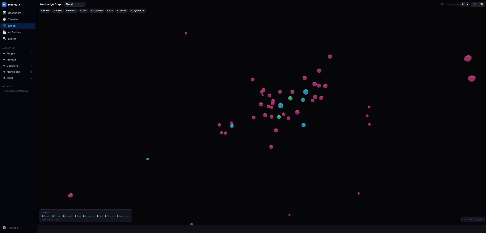

<p align="center">
  <h1 align="center">Memoark</h1>
  <p align="center"><strong>把你的飞书工作与 AI Agent 会话，沉淀成一份私有、本地的核心记忆，让你的 Agent 真正懂你。</strong></p>
</p>

<p align="center">
  <a href="README.md">English</a> | 简体中文
</p>

<p align="center">
  <a href="LICENSE"></a>
  
  
  
</p>

<p align="center">
  
  <br>
  <em>把你的工作变成一张活的知识图谱 —— 人、决策、任务、知识，全部连起来。</em>
</p>

---

## 痛点

你的工作记忆有两个家，而你的 AI Agent 一个都够不着。

- **飞书**承载你的工作关系网 — 私信、群聊、邮件、会议、任务。这是你*在做什么*、*和谁一起做*。
- **AI Agent**（Claude Code、Codex、OpenClaw）承载你的构建过程 — 每次编程会话里的决策、发现和踩过的坑。

但每次打开新的 Agent 会话，它都一无所知。你得重新解释你是谁、项目是什么、上周决定了什么、为什么。上下文明明*就在某处* — 埋在你再也不会翻的聊天记录和会话日志里。

**你不是记忆力差，你是信息碎片化 — 而你的 Agent 每天都在为此买单。**

## 解决方案

Memoark 是一个**本地优先的个人记忆系统**，建立在两条同等重要的输入流之上 —— 你的**飞书工作**和你的 **AI Agent 会话**。它把两者提取成结构化信号（实体、决策、任务、发现、知识、关系），汇入你自己机器上一个统一、可搜索的知识图谱，再通过 **MCP** 把这份记忆喂回给任何 Agent。

结果是：你的 Agent 既**写入**又**读取**同一份记忆 —— 让 Claude Code、Codex 以及任何 MCP 客户端，终于*懂你和你的工作*。

```
        飞书工作流                  AI Agent 会话
   (私信 / 群聊 / 邮件             (Claude Code / Codex
    会议 / 任务)                    / OpenClaw)
           │                               │
           └───────────────┬───────────────┘
                           ▼   采集 + 抽取（本地）
                  ┌──────────────────┐
                  │   你的核心记忆    │  实体 · 决策 · 任务
                  │  (PGLite, 本地)   │  知识 · 时间线 · 图谱
                  └────────┬─────────┘
                           ▼  MCP
                   你的 Agent 懂你
                           │
                           └──── Agent 用得越多，记忆越懂你 ───┘
```

> "我昨天在飞书和同事讨论了一个方案，今天在 Claude Code 里实现了一部分，下周还有个评审会。"
>
> Memoark 自动把这三件事串起来 —— 跨平台、跨时间 —— 并在你需要时把完整脉络交给 Agent。

## 核心特性

**🛰️ 飞书全量采集**
你的工作在飞书里。Memoark 覆盖 **7 个源** —— 私信、群聊、邮件、日历、文档、任务、消息搜索 —— 把你的工作关系网变成结构化记忆。

**🤖 让 Agent 懂你（MCP）**
把 Memoark 作为任何 MCP Agent 的记忆层 —— Claude Code、Cursor、Windsurf。**17 个内置工具**让 Agent 查询你的历史、读取实体页面、写回新知识。Agent 既是记忆的生产者，也是消费者。

**🔒 私密 & 本地优先**
数据永远不离开你的机器。PGLite 嵌入式数据库，可选 Ollama 本地向量嵌入，无云依赖。

**🧠 AI 驱动信号提取**
LLM 驱动的 Pipeline 从原始对话中提取 7 类结构化信号：实体、时间线、决策、任务、发现、知识、关系。

**🔍 混合语义搜索**
全文搜索（tsvector）+ 向量检索（pgvector），通过 RRF（Reciprocal Rank Fusion）融合排序。支持自然语言提问。

**🕸️ 知识图谱 + Web UI**
看见人、项目、决策之间的关联。内置 Web UI 提供 Dashboard、时间线、力导向知识图谱和搜索。

**🔌 REST API**
基于 Hono 的 HTTP API，暴露所有存储操作。

## 使用场景

**几秒钟让 Agent 接手一个项目**
打开 Claude Code 会话，问一句 *"memoark 这个项目现在进展如何？"* —— Agent 直接从你的记忆里拉出聚合的决策、待办任务和最近时间线，无需你重新解释。

**回忆某人、某件事**
*"我上周和同事聊了什么？"* —— Memoark 把飞书私信、会议、后续任务串成一个答案。

**自动生成的工作日志**
像翻日记一样浏览你的时间线 —— 你做了什么决策、交付了什么、跨了哪些平台，全部自动写好。

## 为什么选 Memoark

| | Memoark | 纯 RAG / 向量检索 | 笔记工具（Obsidian / Notion） | GBrain | OpenHuman |
|---|:---:|:---:|:---:|:---:|:---:|
| 本地优先 & 私密 | ✅ | 视情况 | 视情况 | ✅ | ✅ |
| 开源 | ✅ | 不一定 | 部分 | 部分 | ✅ |
| 飞书工作采集（私信/群聊/邮件/会议/任务） | ✅ | ❌ | 手动 | ❌ | ❌ |
| 把 AI Agent 会话作为数据源 | ✅ | ❌ | ❌ | ✅ | ✅ |
| Agent 原生：通过 MCP 既读**又**写 | ✅ | ❌ | ❌ | ✅ | 部分 |
| 实体 + 关系知识图谱 | ✅ | ❌ | 手动 | ✅ | 部分 |
| 结构化信号提取（不只是分块） | ✅ | ❌ | ❌ | ✅ | ✅ |
| 精简的 MCP 工具面（17 个，而非 40+） | ✅ | 不适用 | 不适用 | ❌（40+） | 不一定 |

> 纯 RAG 只有向量、没有实体和关系，回答缺乏上下文；笔记工具强大但依赖手动维护；GBrain 能力强但偏重、MCP 工具过多。Memoark 保持本地、精简、Agent 原生 —— 并把飞书工作作为一等数据源。

## 快速开始

### 前置条件

- [Bun](https://bun.sh) >= 1.0.0 — 安装命令：`curl -fsSL https://bun.sh/install | bash`
- （可选）[Ollama](https://ollama.ai) 本地嵌入

### 安装

```bash
git clone https://github.com/AndreLYL/memoark.git
cd memoark
bun install
npm link          # 注册 memoark 全局命令
```

### 初始化配置

运行交互式向导 — 自动检测数据源、硬件配置，引导完成 LLM + Embedding 配置：

```bash
memoark init
```

向导会自动完成：
- 检测本机已有的数据源（Claude Code、Codex、Hermes）
- 评估硬件配置，推荐本地（Ollama）或远程（OpenAI）Embedding
- 引导配置 LLM provider / model / API key，并测试连通性
- 自动注册 `memoark` 命令（如未完成）

### 检查环境

```bash
memoark doctor
```

### 运行提取

```bash
# 从 Claude Code 提取
memoark extract --source claude-code

# 从 Codex 提取
memoark extract --source codex

# 从所有启用的数据源提取
memoark extract --source all

# 干跑模式（不调用 LLM，仅扫描数据量）
memoark extract --source claude-code --dry-run
```

### 飞书私聊/群聊提取

飞书消息有两条不同路径：

- `sources.feishu.sources.messages` 使用 OpenAPI chat/message 接口，适合明确群聊 `chat_id` 或自动发现到的群聊。
- `sources.feishu.sources.message_search` 使用 `lark-cli im +messages-search`，适合 user-mode 下搜索最近私聊和群聊。私聊机器人对话通常需要这条路径，否则最近三天会明显少数据。

本地需要先完成 lark-cli 的飞书用户态登录，并在 `memoark.yaml` 打开 `message_search`：

```yaml
llm:
  provider: openai
  model: gpt-4.1-mini
  api_key: ${TOKENFREE_API_KEY}

sources:
  feishu:
    enabled: true
    auth_mode: user
    app_id: ${FEISHU_APP_ID}
    app_secret: ${FEISHU_APP_SECRET}
    sources:
      messages:
        enabled: true
        chat_ids: []
        lookback_days: 3
      message_search:
        enabled: true
        chat_types:
          - p2p
          # - group
        lookback_days: 3
        page_size: 50
```

然后运行：

```bash
bun src/cli.ts extract --source feishu --adapter store --since 3d
```

`--dry-run` 只验证采集数量，不写数据库、不提交 cursor：

```bash
bun src/cli.ts extract --source feishu --adapter store --since 3d --dry-run
```

### 增量状态与重建

Memoark 的增量状态分两层：

- 数据库：默认在 `~/.memoark/data`，保存提取后的页面、chunk、关系和时间线。
- 运行状态：当前仓库的 `.memoark/cursors.yaml` 和 `.memoark/dedup.jsonl`，分别保存源 cursor 和消息去重 hash。

正常增量运行不要手动删这些文件。需要删除某个源的过期提取结果并重跑时，用内置命令，它会先备份数据库和 `.memoark`：

```bash
# 先预览会删除多少内容
bun src/cli.ts store purge-source feishu

# 确认后清理飞书结果、飞书 cursor，并重置旧格式 dedup
bun src/cli.ts store purge-source feishu --yes

# 再跑最近三天
bun src/cli.ts extract --source feishu --adapter store --since 3d
```

旧版 `dedup.jsonl` 只记录 hash，没有记录来源平台，所以彻底重跑飞书时默认会备份后清空整个 dedup。后续增量会重新建立去重状态。

### 搜索记忆

```bash
# 混合搜索（全文 + 向量）
memoark search "认证中间件决策"

# 仅全文搜索
memoark search "JWT token" --mode fts
```

### 启动服务器

```bash
# HTTP API（默认端口 3927）
memoark serve

# MCP stdio（AI Agent 集成 — Claude Code、Cursor 等）
memoark serve --mcp
```

### 接入你的 Agent（MCP）

让任何 MCP 客户端指向 Memoark，即可读写你的记忆。以 Claude Code 为例：

```json
{
  "mcpServers": {
    "memoark": {
      "command": "memoark",
      "args": ["serve", "--mcp"]
    }
  }
}
```

然后就可以让 Agent *"在我的记忆里搜一下 auth 重构的决策"* 或 *"项目 X 还有哪些未完成任务？"* —— 它会从你的本地记忆作答。

### 浏览 Web UI

```bash
cd web
bun install
bun run dev        # Dashboard、时间线、知识图谱、搜索
```

## 架构

```
┌─────────────────────────────────────────────────────────────────┐
│                        数据源                                    │
│  Claude Code  │  Codex  │  Hermes  │  飞书  │  微信              │
└───────┬───────┴────┬────┴────┬─────┴────┬───┴────┬──────────────┘
        └────────────┴────────┴──────────┴────────┘
                              │
                    ┌─────────▼──────────┐
                    │   信号提取 Pipeline  │
                    │                    │
                    │  采集 → 去重        │
                    │  → 分块 → 噪声过滤  │
                    │  → 信号提取 → 脱敏  │
                    └─────────┬──────────┘
                              │
                    ┌─────────▼──────────┐
                    │   存储层            │
                    │                    │
                    │  PGLite + pgvector │
                    │  （嵌入式 PG）      │
                    └─────────┬──────────┘
                              │
              ┌───────────────┼───────────────┐
              │               │               │
     ┌────────▼──────┐ ┌─────▼──────┐ ┌──────▼───────┐
     │   CLI          │ │  MCP       │ │  REST API    │
     │   管理 & 提取   │ │  服务器     │ │  (Hono)      │
     └────────────────┘ └────────────┘ └──────────────┘
```

### 信号类型

| 信号类型 | 说明 | 示例 |
|---------|------|------|
| **实体** | 人物、项目、工具、概念 | `project/memoark`, `tool/claude-code` |
| **时间线** | 关键事件及时间戳 | "2026-05-19: 完成多平台采集器重构" |
| **决策** | 架构选型、技术决策及其理由 | "选择 PGLite 作为嵌入式 PostgreSQL 方案" |
| **任务** | 待办事项及状态追踪 | `[open] 实现 token 自动刷新` |
| **发现** | 技术洞察、bug 根因、edge case | "UUID v4 不可按字典序排序" |
| **知识** | 可复用的事实性知识 | "PGLite 通过 WASM 在进程内运行完整 Postgres" |
| **关系** | 实体间的依赖、引用、协作 | `project/memoark --[depends_on]--> tool/pglite` |

### 存储层

| 组件 | 说明 |
|------|------|
| **PageStore** | Wiki 风格页面，YAML frontmatter，CRUD |
| **ChunkStore** | 递归文本分块（300 词，50 词重叠），嵌入复用 |
| **SearchEngine** | tsvector 全文搜索 + pgvector 向量搜索，RRF 融合排序 |
| **GraphStore** | 有向链接图，BFS 遍历，链接类型过滤，反向链接 |
| **TagStore** | 页面标签，冲突安全 upsert |
| **TimelineStore** | 按时间排序的条目，去重 |
| **EmbeddingService** | OpenAI / Ollama 批量嵌入，过期 chunk 检测 |

## CLI 命令

### `memoark extract`

从数据源提取信号。

```bash
memoark extract \
  --source <name>              # claude-code, codex, hermes, feishu, all
  --format json|markdown       # 输出格式，默认 json
  --adapter store|file|gbrain|stdout  # 输出目标，默认 store
  --since <date>               # 只处理此日期之后的消息
  --limit <n>                  # 限制消息数
  --dry-run                    # 测试模式
```

### `memoark serve`

启动服务器。

```bash
memoark serve              # HTTP API
memoark serve --mcp        # MCP stdio 传输
```

### `memoark search <query>`

搜索存储的记忆。

```bash
memoark search "认证中间件"           # 混合搜索（默认）
memoark search "JWT" --mode fts      # 仅全文搜索
memoark search "部署" --limit 5      # 限制结果数
```

### `memoark embed`

为未嵌入的 chunk 生成向量嵌入。

```bash
memoark embed                  # 嵌入所有过期 chunk
memoark embed --limit 100     # 限制批量大小
```

### `memoark doctor`

诊断配置和环境。

### `memoark config init`

生成配置模板。

### `memoark sources list` / `memoark sources test <name>`

列出或测试数据源。

## 配置

### `memoark.yaml`

```yaml
# 隐私配置
privacy:
  enabled: true
  mode: reversible           # reversible（可逆）| irreversible（不可逆）
  redact_phone: true
  redact_id_card: true
  redact_bank_card: true
  replacement: "[REDACTED]"

# LLM（信号提取用）
llm:
  provider: openai
  model: gpt-4o-mini
  api_key: ${OPENAI_API_KEY}

# 分块配置
block_builder:
  block_gap_minutes: 30
  max_block_tokens: 4000
  max_block_messages: 100

# 数据源
sources:
  claude-code:
    enabled: true
  codex:
    enabled: true
  hermes:
    enabled: true

# 存储（PGLite）
store:
  data_dir: ~/.memoark/data

# 嵌入
embedding:
  provider: openai           # openai | ollama
  model: text-embedding-3-large
  dimensions: 1536
  api_key: ${OPENAI_API_KEY}

# 服务器
server:
  http_port: 3927
```

## 支持的数据源

| 数据源 | 路径 | 说明 |
|--------|------|------|
| **飞书（Lark）** | API + lark-cli | 核心工作源 —— 7 个源：群聊、私信、邮件、日历、文档、任务、消息搜索 |
| **Claude Code** | `~/.claude/projects/` | Claude Code Agent 对话记录 |
| **Codex** | `~/.codex/` | OpenAI Codex CLI 会话 |
| **Hermes** | `~/.openclaw/agents/` | OpenClaw Hermes Agent 会话 |

> 飞书优先：它承载的是工作本身 —— 需求讨论、技术方案、团队决策。私信和最近会话需要先完成 `lark-cli` 用户态登录并启用 `message_search`（详见上方配置）。

## 路线图

### Phase 1 — 信号提取（已完成）

- [x] 多平台采集器（Claude Code、Codex、Hermes、飞书）
- [x] LLM 驱动的噪声过滤和信号提取
- [x] 7 类信号：实体、时间线、决策、任务、发现、知识、关系
- [x] 双轨隐私脱敏（可逆 + 不可逆）
- [x] JSON 和 Markdown 输出格式

### Phase 2 — 存储 & 服务器（已完成）

- [x] PGLite 嵌入式 PostgreSQL + pgvector
- [x] PageStore、ChunkStore、TagStore、TimelineStore、GraphStore
- [x] 全文搜索（simple 分词器，支持中文）+ 向量搜索
- [x] RRF 混合搜索
- [x] EmbeddingService（OpenAI / Ollama）
- [x] StoreAdapter — Pipeline 直接写入 PGLite
- [x] Hono REST API
- [x] MCP 服务器（17 个 stdio 工具）
- [x] CLI serve、search、embed 命令

### Phase 3 — Web UI（已完成）

- [x] Dashboard
- [x] 时间线视图
- [x] 知识图谱可视化（力导向）
- [x] 搜索界面
- [x] 实体 / 页面详情

### Phase 4 — 上下文感知提取（规划中）

- [ ] ContextBuffer —— 跨 block 共享上下文
- [ ] 加权准入评分（替换二元噪声过滤）
- [ ] NarrativeAssembler —— 按实体聚合叙事

### Phase 5 — 巩固与常驻服务（规划中）

- [ ] 记忆巩固（dream cycle）：实体合并、链接修复、模式发现
- [ ] 常驻后台服务 + 定时采集
- [ ] 自然语言问答

### Phase 6 — 同步与新数据源（规划中）

- [ ] Obsidian 双向同步
- [ ] 微信聊天记录
- [ ] 更多平台（社区驱动）

## 技术栈

| 层 | 技术 |
|----|------|
| 语言 | TypeScript |
| 运行时 | Bun |
| 数据库 | PGLite（嵌入式 PostgreSQL） |
| 向量搜索 | pgvector |
| 嵌入 | OpenAI / Ollama |
| Web 框架 | Hono |
| Web UI | React + Vite |
| MCP | @modelcontextprotocol/sdk |
| Linter | Biome |
| 测试 | Vitest（800+ 测试） |

## 开发

```bash
bun run test              # 全量测试
bun run test:watch        # 监听模式
bun run typecheck         # 类型检查
bun run lint              # 代码检查
bun run lint:fix          # 自动修复
```

详见 [CONTRIBUTING.md](CONTRIBUTING.md)。

## 社区与支持

- 🐛 发现 bug 或有功能建议？[提交 issue](https://github.com/AndreLYL/memoark/issues)。
- 💡 欢迎在 issue 区交流问题和想法。

## License

基于 [Apache License 2.0](LICENSE) 开源。
