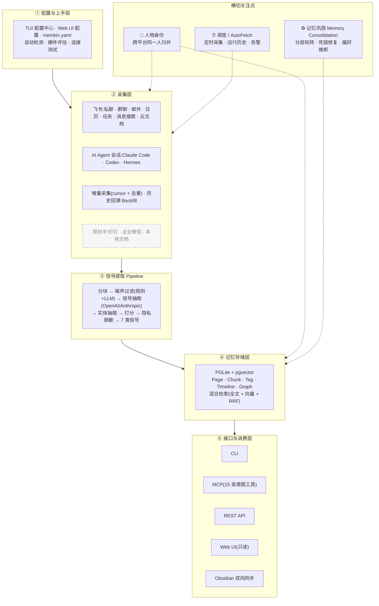

# 架构详解

> [← 返回 README](../README.md) · Memkin 是 **5 层纵向数据流 + 3 个横切关注点**。

  

## 分层说明

| 层 | 职责 |
|----|------|
| **① 配置与上手层** | TUI 配置中心（React + ink）、浏览器 setup 向导、`memkin.yaml` 手编；自动检测运行时 / API key / 数据源，硬件评估推荐 Embedding，实时连接测试 |
| **② 采集层** | 飞书（私聊 / 群聊 / 邮件 / 日历 / 任务 / 消息搜索 / 云文档）、AI Agent 会话（Claude Code / Codex / Hermes）；增量采集（per-source cursor + 内容去重）、历史回溯 Backfill。**规划中**：钉钉、企业微信、本地文档 |
| **③ 信号提取 Pipeline** | 分块 → 噪声过滤（L1 规则 + L2 LLM）→ 信号抽取（OpenAI / Anthropic）→ 实体抽取 → 打分 → 隐私脱敏；产出 7 类信号，经输出适配器（store / file / gbrain / stdout）落库 |
| **④ 记忆存储层** | PGLite（进程内嵌入式 PostgreSQL）+ pgvector；Page / Chunk / Tag / Timeline / Graph 存储；混合检索（tsvector 全文 + 向量 + RRF） |
| **⑤ 接口与消费层** | CLI、MCP Server（默认 15 个高意图工具，Agent 读 / 写 / 维护）、REST API（Hono）、Web UI（检索 / 查看 / 图谱 / 时间线，**当前只读**）、Obsidian 双向同步 |

**横切关注点**（贯穿多层，而非独立流水线层）：

- **🧬 人物身份** — 贯穿「采集 ↔ 存储」：跨平台（飞书 open_id、邮箱、昵称）识别并归并同一个人，别名绑定、规范化。这是「社会关系总和」的地基。
- **♻️ 记忆巩固（Memory Consolidation）** — 后台旁路作用于存储层：hot → warm → cold 分层轮转、死链修复、偏好推断，让记忆自我整理。
- **⏰ 调度 / AutoFetch** — 后台驱动采集层：定时自动采集、运行历史、告警。`memkin up` 把它注册为开机自启的常驻后台服务（macOS launchd / Linux systemd）。

> **运行平台**：macOS / Linux / Windows（默认内嵌 PGLite，开箱即用）。自管理本地 Postgres 引擎（`store.engine: managed`，更快，可选）支持 macOS（arm64 / x64）与 Linux（x64 / arm64）。

## 信号类型

| 信号类型 | 说明 | 示例 |
|---------|------|------|
| **实体** | 人物、项目、工具、概念 | `project/memkin`, `tool/claude-code` |
| **时间线** | 关键事件及时间戳 | "2026-05-19: 完成多平台采集器重构" |
| **决策** | 架构选型、技术决策及其理由 | "选择 PGLite 作为嵌入式 PostgreSQL 方案" |
| **任务** | 待办事项及状态追踪 | `[open] 实现 token 自动刷新` |
| **发现** | 技术洞察、bug 根因、edge case | "UUID v4 不可按字典序排序" |
| **知识** | 可复用的事实性知识 | "PGLite 通过 WASM 在进程内运行完整 Postgres" |
| **关系** | 实体间的依赖、引用、协作 | `project/memkin --[depends_on]--> tool/pglite` |

> 以上为 7 类核心信号；此外还有 **Preference**（偏好推断产出）与 **Reference**（引用沉淀）等衍生信号类型。

## 存储层组件

| 组件 | 说明 |
|------|------|
| **PageStore** | Wiki 风格页面，YAML frontmatter，CRUD |
| **ChunkStore** | 递归文本分块（300 词，50 词重叠），嵌入复用 |
| **SearchEngine** | tsvector 全文搜索 + pgvector 向量搜索，RRF 融合排序 |
| **GraphStore** | 有向链接图，BFS 遍历，链接类型过滤，反向链接 |
| **TagStore** | 页面标签，冲突安全 upsert |
| **TimelineStore** | 按时间排序的条目，去重 |
| **EmbeddingService** | OpenAI / Ollama 批量嵌入，过期 chunk 检测 |

## 技术栈

| 层 | 技术 |
|----|------|
| 语言 | TypeScript |
| 运行时 | Node.js >= 18（用户侧）；开发使用 Bun |
| 数据库 | PGLite（嵌入式 PostgreSQL）；可选自管理 Postgres 引擎 |
| 向量搜索 | pgvector |
| 嵌入 | OpenAI / Ollama |
| Web 框架 | Hono |
| Web UI | React + Vite |
| MCP | @modelcontextprotocol/sdk |
| Linter | Biome |
| 测试 | Vitest |

## Mermaid 源码（可编辑）

